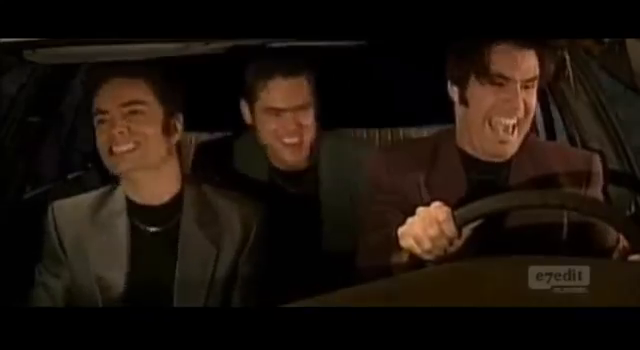
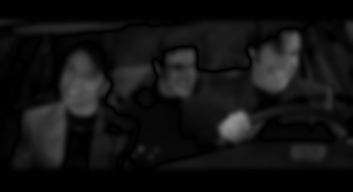
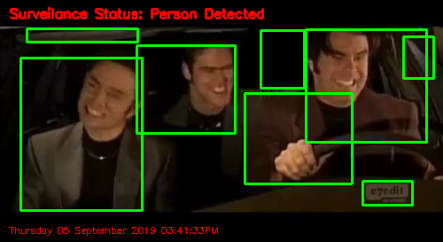
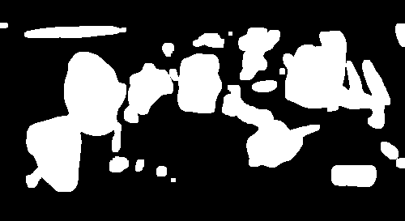

# Optical Flow
What is optical flow?

### Demo
#### Draw a box around an object in your webcam and watch as the computer struggles to follow

This algorithim watches changes in the 

Run ```python3 webcam_tracking_demo.py -[videoname.mp4]```

##### Analysis
Does not handle occlusions well
Does not understand what is in image, only follows groups of pixels


### Farneback
#### Computes a dense optical flow using the Gunnar Farneback’s algorithm

This algorithim highlights the largescale shifts in an image where the color intensity is respective of the craziness of the change

Run ```python3 farnebeck.py -[videoname.mp4]```

##### Example

  

##### Analysis
This script, in its current form, is useless.


### Lucas-Kanade
#### Calculates an optical flow for a sparse feature set using the iterative Lucas-Kanade method with pyramids.

This algorithim highlights the small movements of points of interest and draws a line over the frame

Run ```python3 LK.py -[videoname.mp4]```

##### Example


##### Analysis
DOES NOT WORK FOR CHANGES IN SCENE
AUTOMATICALLY DETECTS POINT OF INTEREST BASED ON CORNER DETECTION KERNEL
DOES NOT FIND TRACK PEOPLE WHO ARENT PRESENT IN FIRST FRAME

Lucas-Kanade


### Really Bad Algorithim
#### Calculates an optical flow for a sparse feature set using the iterative Lucas-Kanade method with pyramids.

This tries to detect the people in the frame (and does a bad job at it), as well as shows the change from the original image, which it interprets as a state 0 background, and a threshold map of all the movement
Run ```python3 really_bad_algorithim.py -v [videoname.mp4]```

##### Example

  

##### Analysis
DOES NOT WORK FOR CHANGES IN SCENE
AUTOMATICALLY DETECTS POINT OF INTEREST BASED ON CORNER DETECTION KERNEL
DOES NOT FIND TRACK PEOPLE WHO ARENT PRESENT IN FIRST FRAME

Lucas-Kanade

